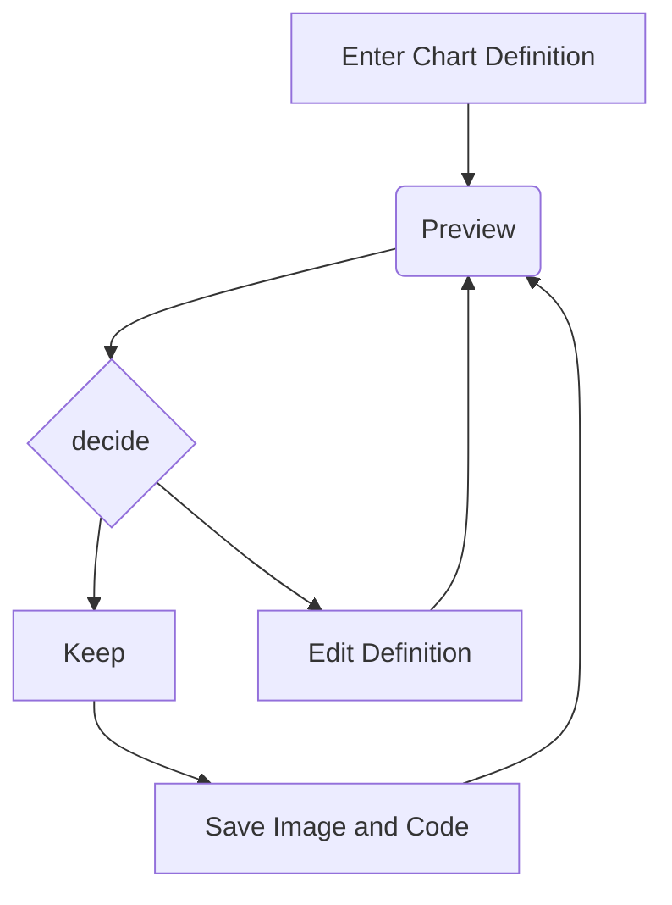
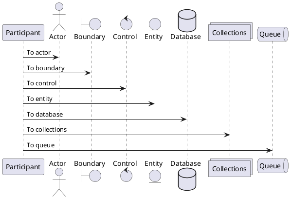

# Advanced examples

## Video

Some pretty video:

<iframe
    width="560"
    height="560"
    src="https://www.youtube.com/embed/sGF6bOi1NfA?si=YtSJFaGVxvQMmrNZ"
    title="YouTube video player"
    frameborder="0"
    allow="accelerometer; autoplay; clipboard-write; encrypted-media; gyroscope; picture-in-picture; web-share"
    allowfullscreen>
</iframe>

Some text here.

## Website

Anything that allows you to embed a website, you can use too:

<iframe
    src="https://www.google.com/maps/embed?pb=!1m28!1m12!1m3!1d5018.051311095338!2d3.700269598821751!3d51.03414688375593!2m3!1f0!2f0!3f0!3m2!1i1024!2i768!4f13.1!4m13!3e6!4m5!1s0x47c373dfecba42a1%3A0x967548ec6ae567f6!2sGent%20Sint%20Pieters%20Station%2C%20Koningin%20Maria%20Hendrikaplein%2C%20Ghent!3m2!1d51.036234!2d3.7108572!4m5!1s0x47c373d974e7039b%3A0x2b5e1bf81b807f8c!2sHOGENT%20campus%20Schoonmeersen%2C%20Valentin%20Vaerwyckweg%201%2C%209000%20Gent!3m2!1d51.0330995!2d3.7030491999999997!5e0!3m2!1sen!2sbe!4v1697794155393!5m2!1sen!2sbe"
    width="560"
    height="560"
    referrerpolicy="no-referrer-when-downgrade">
</iframe>

You can scroll, zoom in/out, ... .

## Graphs

You can use [Mermaid](https://mermaid.js.org/intro/) to create diagrams from text:

You can also use [PlantUML](https://plantuml.com/news) to create diagrams from text:

## Checkboxes

- [ ] Unchecked
- [x] Checked

## Footnotes

There must be a footnote[^1] somewhere. I also heard there was also a second one[^2].

[^1]: Found the first one!

[^2]: Ah, and here is the second one!

## Emoji's

:tada: :smile: :thumbsup: :100:

:link: :speech_balloon: :wrench:

:construction: :warning: :exclamation: :no_entry_sign: :no_entry: :x:

- https://github.com/ikatyang/emoji-cheat-sheet/blob/master/README.md
- https://gitmoji.dev/
- https://emoojees.com/

## Superscript

H^2^0

text^a\ superscript^

## Mark

This text is ==marked== because it is important.

## And a lot more!

- https://facelessuser.github.io/pymdown-extensions/extensions/arithmatex/
